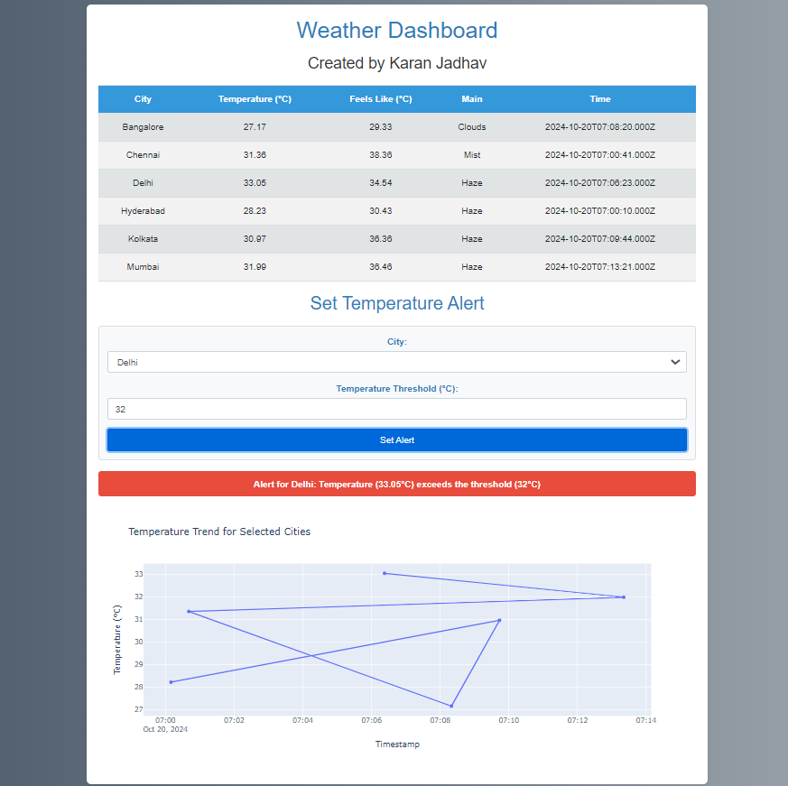

Here’s a well-structured and detailed `README.md` file for your project:

---

# Weather Monitoring System

This is a Flask-based weather monitoring web application that uses the OpenWeatherMap API to display real-time weather data for multiple cities. It features live weather updates, interactive temperature trend charts, and an alert system for setting temperature thresholds by the user.

## Features

- **Real-time Weather Data**: Displays current weather information for multiple cities.
- **Interactive Visualization**: Line charts to show temperature trends using Plotly.
- **Alert System**: Users can set temperature alerts for specific cities, notifying them when thresholds are exceeded.
- **Auto-Refresh**: The weather data and visualizations refresh automatically every 5 seconds.
- **Advanced Styling**: A visually appealing, responsive design with customized CSS for a better user experience.
- **Configurable via `.env`**: API keys, logging, and other configurations can be set via a `.env` file.

## Demo



---

## Installation

### 1. Clone the repository

```bash
git clone https://github.com/yourusername/weather-monitoring-system.git
cd weather-monitoring-system
```

### 2. Create and activate a virtual environment

```bash
# On Linux/MacOS
python3 -m venv venv
source venv/bin/activate

# On Windows
python -m venv venv
venv\Scripts\activate
```

### 3. Install dependencies

```bash
pip install -r requirements.txt
```

### 4. Create a `.env` file

Create a `.env` file in the project root directory and add the following configurations:

```bash
# OpenWeatherMap API Key
API_KEY=your_openweathermap_api_key

# Flask settings
SECRET_KEY=your_secret_key
DEBUG=True
FLASK_HOST=0.0.0.0
FLASK_PORT=5000

# Logging
LOG_FILE=app.log
LOG_LEVEL=INFO
```

### 5. Configure OpenWeatherMap API

You will need an API key from [OpenWeatherMap](https://home.openweathermap.org/users/sign_up). Add this key to your `.env` file.

### 6. Start the Application

Use the `start.py` script to run the application.

```bash
python start.py
```

The application will be accessible at `http://localhost:5000` or the IP you configured in the `.env` file.

---

## Project Structure

```
weather-monitoring-system/
│
├── app/
│   ├── weather_data.py    # Weather data fetching logic using OpenWeatherMap API
│   ├── ui/
│   │   ├── templates/     # HTML files
│   │   ├── static/        # CSS and JS files
│   │   └── main.py        # Flask app routes
│
├── config.py              # Configuration settings
├── start.py               # Entry point for deployment
├── requirements.txt       # Python dependencies
├── README.md              # Project documentation
├── .env                   # Environment variables (created manually)

```

---

## Usage

### 1. Set Alerts

- Go to the **Set Alerts** section of the app.
- Select a city and input the temperature threshold.
- Alerts will notify you on the UI when the temperature crosses the threshold.

### 2. View Temperature Trends

- The application visualizes the temperature trends of multiple cities using Plotly graphs.
- The graphs auto-update every 5 seconds.

### 3. Auto-refresh Weather Data

- The page will refresh every 5 seconds to fetch the latest weather data.

---

## Deployment

### Running with Gunicorn (for Production)

```bash
# Install Gunicorn
pip install gunicorn

# Run the application
gunicorn -w 4 -b 0.0.0.0:5000 start:app
```

### Nginx Configuration (Optional)

If you're deploying the app behind Nginx, you can set up Nginx as a reverse proxy.

Example Nginx configuration:

```nginx
server {
    listen 80;
    server_name your_domain.com;

    location / {
        proxy_pass http://127.0.0.1:5000;
        proxy_set_header Host $host;
        proxy_set_header X-Real-IP $remote_addr;
        proxy_set_header X-Forwarded-For $proxy_add_x_forwarded_for;
    }
}
```

---

## Running Tests

```bash
# Run unit tests using unittest
python -m unittest discover -s test
```

---

## Requirements

- Python 3.8+
- Flask
- Plotly
- Gunicorn (for production deployment)
- dotenv

For detailed dependencies, see [requirements.txt](./requirements.txt).

---

## License

This project is licensed under the MIT License.

---

## Credits

- **Weather Data**: [OpenWeatherMap API](https://openweathermap.org/)
- **Graphing Library**: [Plotly](https://plotly.com/)
- **Flask Framework**: [Flask](https://flask.palletsprojects.com/)
